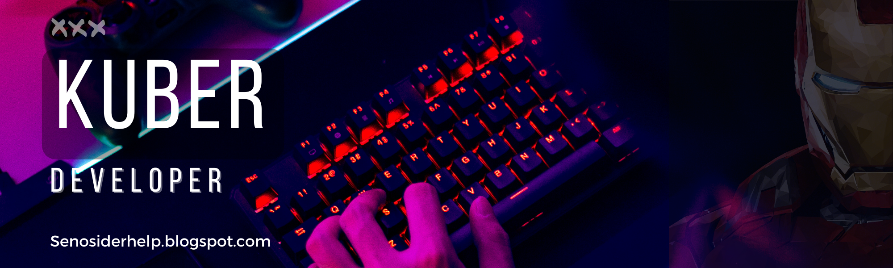

<h1 align="center">Hi 👋, I'm Kuber Khandelwal</h1>
<h3 align="center">Student|Developer</h3>

  

- 📝 I regularly write articles on [https://senosiderhelp.blogspot.com/](https://senosiderhelp.blogspot.com/)

- 📫 How to reach me **kuberkhandelwal2017@gmail.com**

### Blogs posts
<!-- BLOG-POST-LIST:START -->
<!-- BLOG-POST-LIST:END -->
<h3 align="left">Connect with me:</h3>

<h3 align="left">Languages and Tools:</h3>

              

